# Compression

- [Princton Algos ref](http://localhost/pdf/Algos2Compression.pdf)

## Todo 

- Download canterbury corpus
- Test our compression with diffrent compressions.
- Create `CLI` to try our diffrent with Centerbery corpus data

### Tasks 

- Implement **LZW** 
    - coompression
    - decompression
- Implement **LZ78**
- Implement **LZW**
- BackRefrence script
- `A LASS; A LAD; A SALAD; ALASKA`
- Backreferceoveral
- LZSS vs LZ77 implementaionlgo\Algorithms Part II\Week 5 Data Compression\slides_55DataCompression.pdf

## Questions

- [x] Good notes?
- [ ] What is the last part of the Deflate Video
- [ ] What I am missins -
- [x] LZ78 vs LZW ?
- [ ] And of LZ family lecture ?
- [ ] LZW  Notes?


###  B

- [x] Basic explanation on LZ77 and Huffman coding
- [x] Test gzip in windows ? 
- [x] What the diffrence between LZ77 vs LZ78 vs LZSS

### C

- What is hex dump?
- LZMA vs LZMA2 vs BZIP2

## Compression 

- Centery corpus bzip
- UCDAVIC 7z

### UCDAVIC

- [Link](https://fiehnlab.ucdavis.edu/staff/kind/collector/benchmark/7zip-benchmark)

Input: **11 Gbyt** Windws XP VM
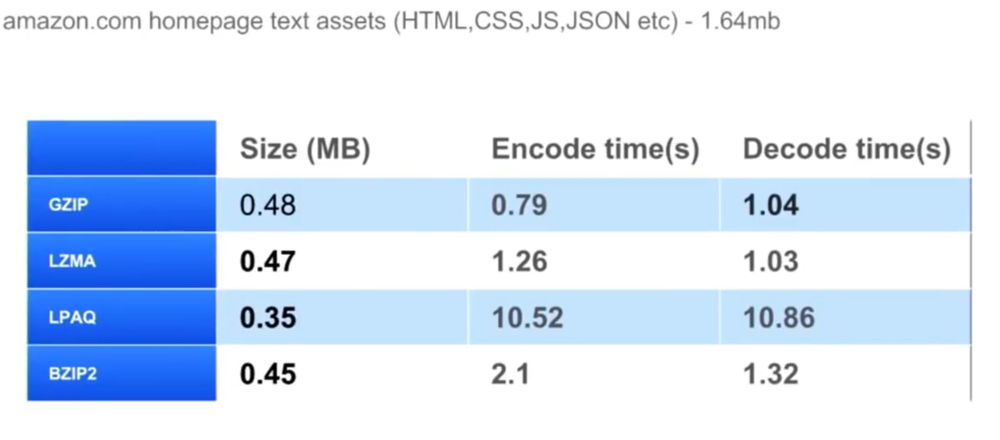

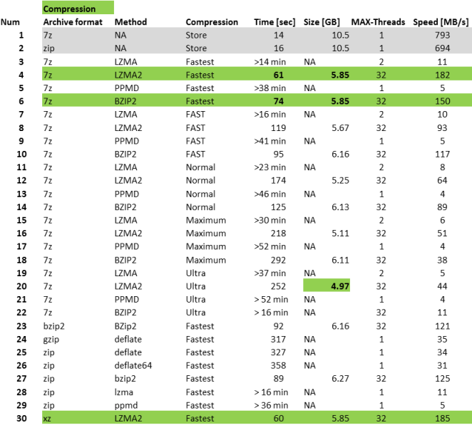

## LZ Family


### Family lines

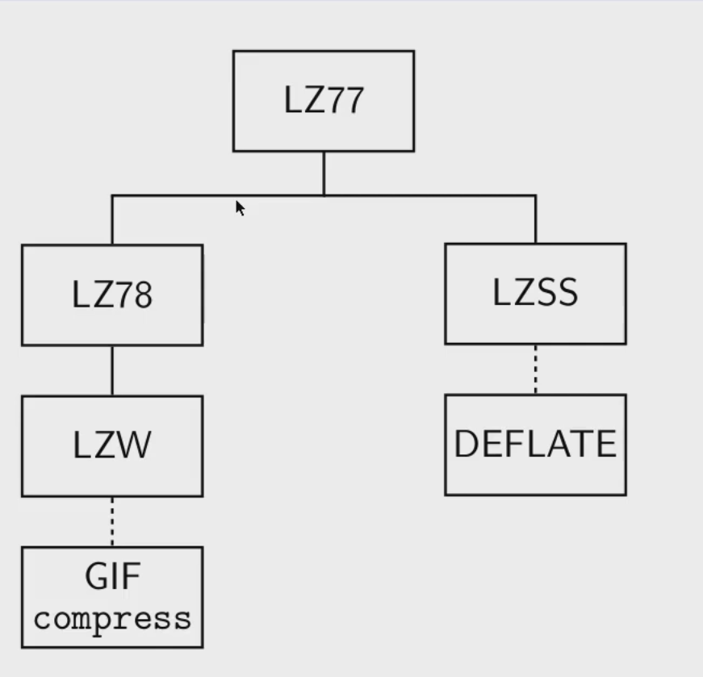

**LZ77** - also known as **LZ1** 
**LZ78** - also knows as **LZ2**
**LZSS** - **L**emper **Z**iv **S**torer **S**zymanki
**LZW** -  **L**empel **Z**iv **W** 

### Terms 

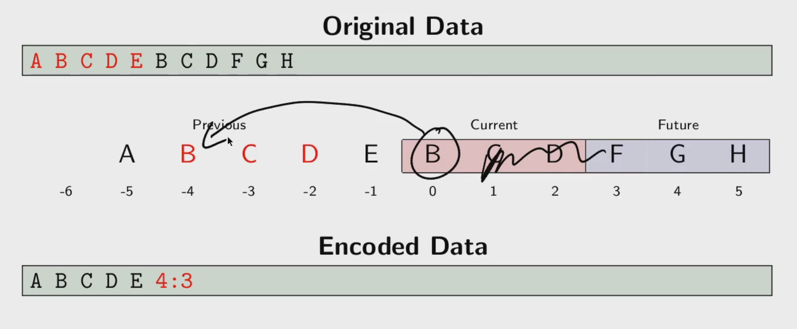 32K for **GZIP**

- **Backrefrecne** - Is refrecne that data was already there

- **Sliding Window** - Have limitation *Previous* and *Future* data.

- **Look Ahead** 

- **Backreference overlap** `2:6` 

- **CL** - **C**ode **L**ength

- **EOB** - **E**nd **O**f **B**lock marker

DEFLATE->LZSS->LZ77 
Length Distance pairs

Gif->LZW->LZ78->LZ77
Symbol table

LZMA->LZ77

### History 

Abraham Lempel - Is from lviv
Presented LZ77 (Lempel-Ziv in 1977)

Jacom Ziv - presented improved version
in 1978

**RLE** **R**un- **L**enght **E**ncoding

## LZW

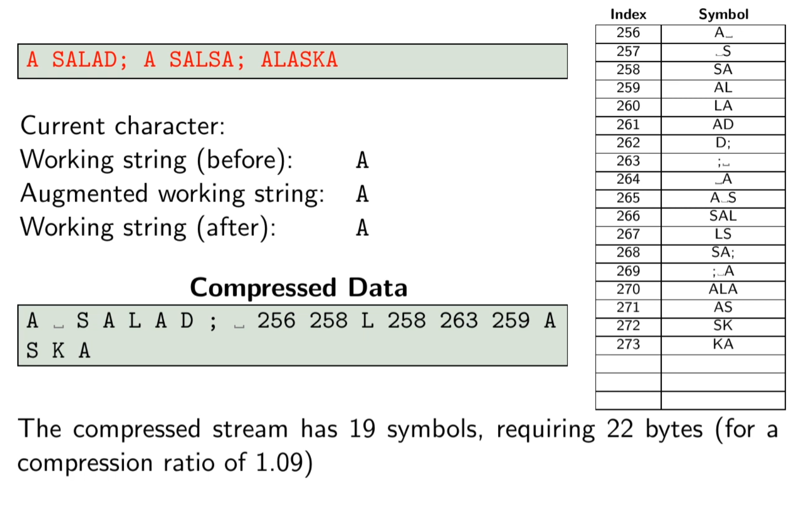

- **W** stands for Welch
- `9-bit` to seprate symbols from refs 
- Standard dictionary of 256 symbols pre defined
- Had Dictionary
- Does not require headers
- **cScSc**
- 1984
- GIF 
- LZW has patent to it.

Was created in 1984. And it's caught on as a relatively simple and fast compression scheme. 


### Algo

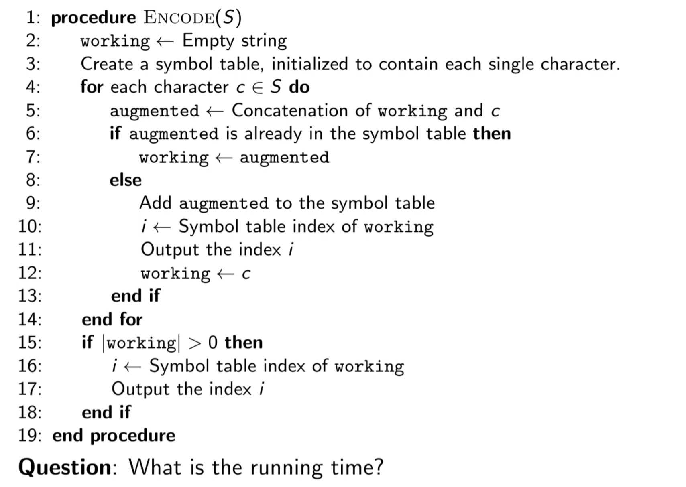

#### Decompression

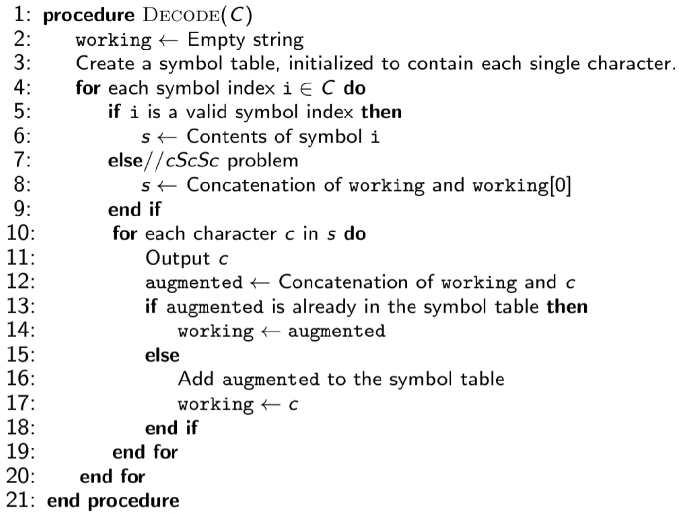

### Compress 

Ancient unix tool 

`compress input.txt`

`compress -d input.txt.Z`

### LZ77

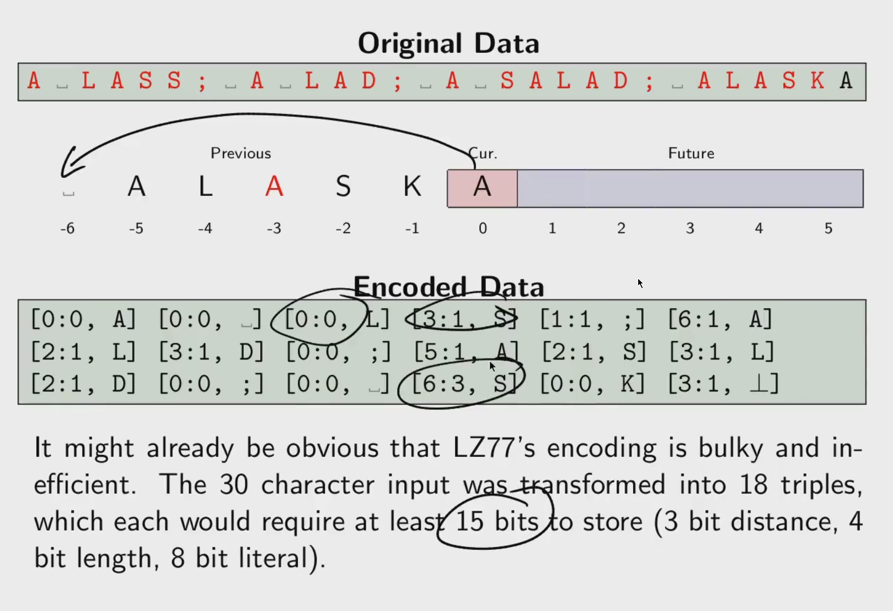

Achives compression by replacing repeated occurences of data with references.

As well known as **LZSS**


## LZSS

**LZSS** - **L**empel- **Z**iv- **S**torer-Szymanski
That was created in 1982 by James A. Storer and Thomas Szymanski.

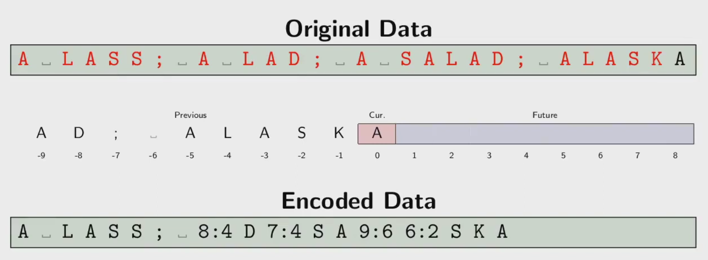

### LZ78

**LZ78** = **LZ77** + Dictiontary


The smae as **LZ77** but with dictionary.
Writen by the Abraham Lember and Jacom Ziv themself.


> from
L
`00000000 00000000 01111111 11111111 10000011 11111111`

> into

 data compresses into values of `17 15 5 10`. 

`00010001 00001111 00000101 00001010`

## GZIP Deflate

**RULE #1 PUSH least significal bit of number FIRST*	

**LSB** - **L**east **S**ignificint **B**it 

- [RFC 1951](https://datatracker.ietf.org/doc/html/rfc1951)

- Has better preformance
- no patent
- Supported in gzip.


`.gz` - file stands for **GZIP** file
`.tar` - stands for multiple files

### Questions 

- [ ] Name of the corpus
- [ ] Do I implent all links in video?
- [ ] How to use gzstat.py ? 
- [ ] Where to find testing data for our algo? 
- [ ] What Unit test can I write

### Roadmap

- HuffmanCoding
- LZSS 

### Unit tests

- [ ] GenreateHuffmanTree() 
- [ ] LZSS() 
- [ ] `PushBit(byte b)`
- [ ] `PullBit():byte`
- [ ] `CreteFileHeader(Data d):byte[]`
- [ ] `ReadFileHdaers(byte[] b):Data`


```c#
void PishByte(){
	throw new NotImplementedException();
}
void GenerateHuffmanTree(string s):HuffmanTree;
void CreateHuffmanTree(string s):HuffmanTree;

class HuffmanTree{
	public Node RootNode;
}

struct Node{

	public bool IsValue;
	public char Value{red}
	public Node Left;
	public Node Right;
}
```

### Notes 

- CLI
	- `hexdump -C SALAD.txt`,
	- `gzip SALAD.txt encoded.gz`
	- `hexdump -C encoded.gz`,
- RFC 1952 RFC 1951
- HEADER; Comress blocks, Footer

### RULE#1: Least significant bit first

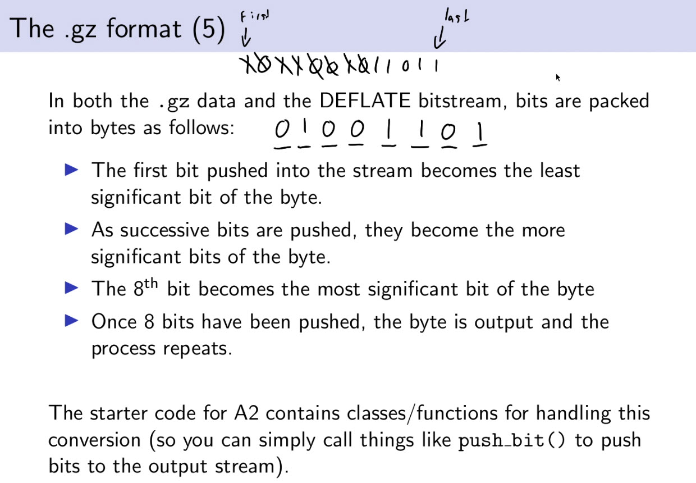

we push it the revers `110` as `011` but only numbers not prefix codes. 

### HEADERS

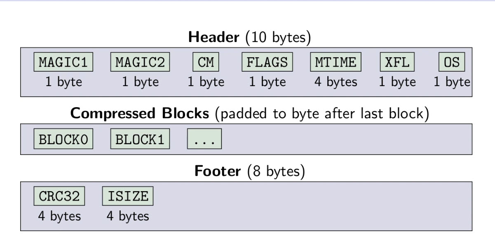

Those `10 bytes` should be always present

- `MAGIC1` 	= 0x1f
- `MAGIC2` 	= 0x8b
- `CM` 		= 0x08 (is DEFLATE)
- `FLAGS` 	= 0x00 for container
- `MTIME`4bytes	= Unix timestam (**LSB** pushed first)
- `XFL`		= 0x00
- `OS` 		= 0x03
    - 0x00 FAT
    - 0x01 Omiga
    - 0x02 VMS
    - 0x03 **UNIX**
    - 0x04 ATARI
    - 0x05 WinNT
    - 0x07 OLD MacOS
    - 0x08 Z system
    - 0x10 TOPS-20
    - 0x11 NTFS

#### Footer

- `CRC32` - is CRC-32 checksum calculates from the each byte of the uncompressed data. `4 byte` numberRule#1 **LSB** first
- `ISIZE` - just size of oriignal uncompressed fileit's a number **LSB** first.


### Links

- [gzstat.py](.\scripts\gzstat.py)
- [Deflate White Paper](http://www.infinitepartitions.com/art001.html)
- [Youtube Lecture](https://youtu.be/oi2lMBBjQ8s)

### FileStructyre

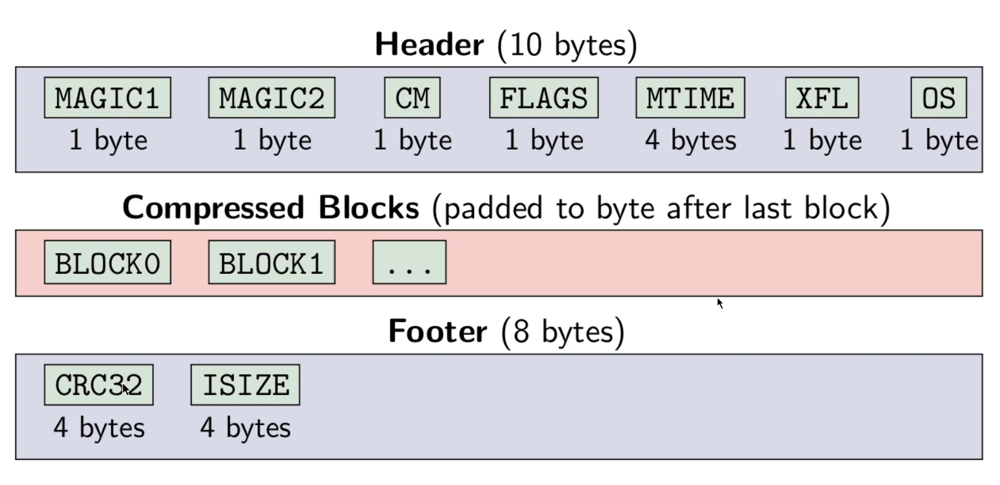

### Block Types
	
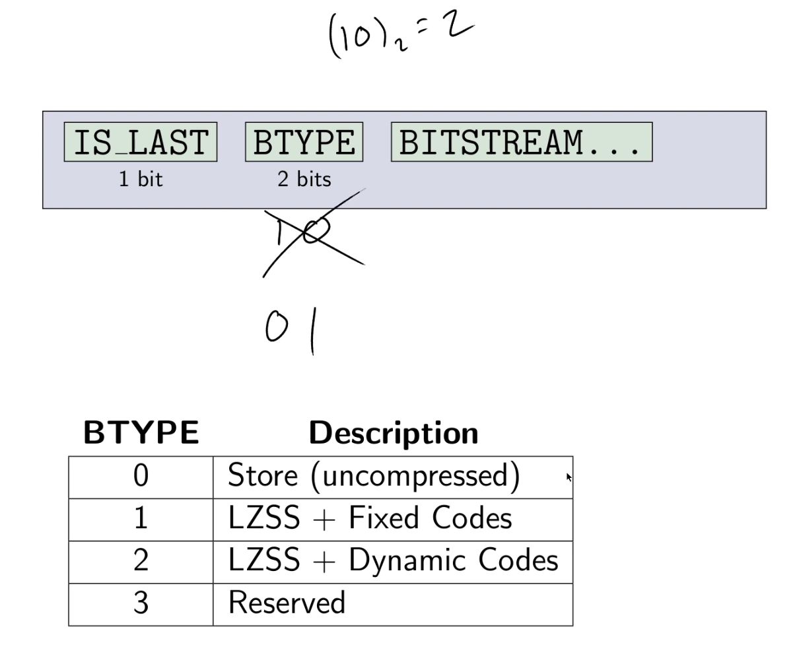

#### Block Type 0


- `IS_LAST` - is last or not
- `BTYPE` - block type
- `PADDING` - just padding
- `LEN`  - number of bytes in the block Rule#1
- `~LEN` - flips swaped the size 
- `BITSTREAM` - 

##### LZSS

It uses **LZSS** encoding

### Literal/Length and Distance Symbols

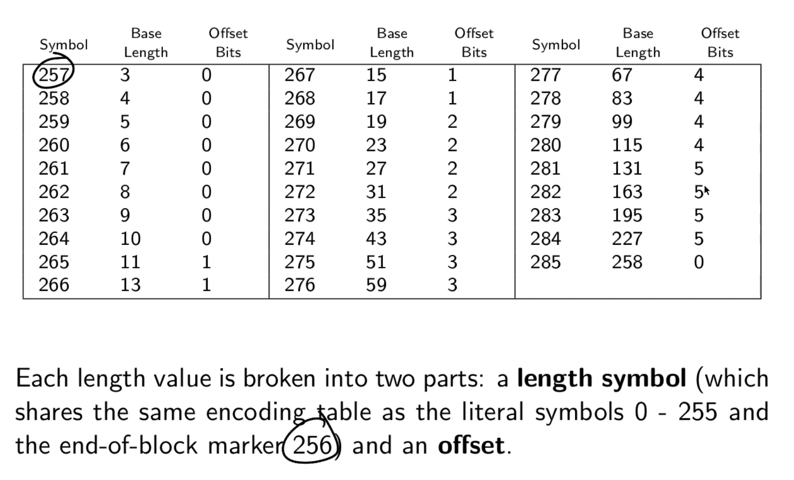

- We cna't incode backreference of size less then 2

##### EOB 

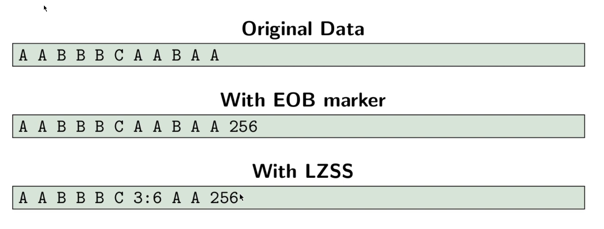

##### Distance Code

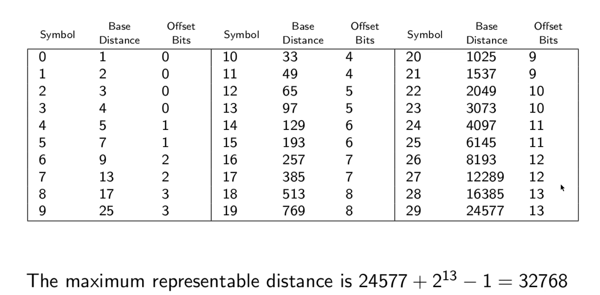

##### LL Code


**LL Code** first then **DC Code**


##### Prefix 

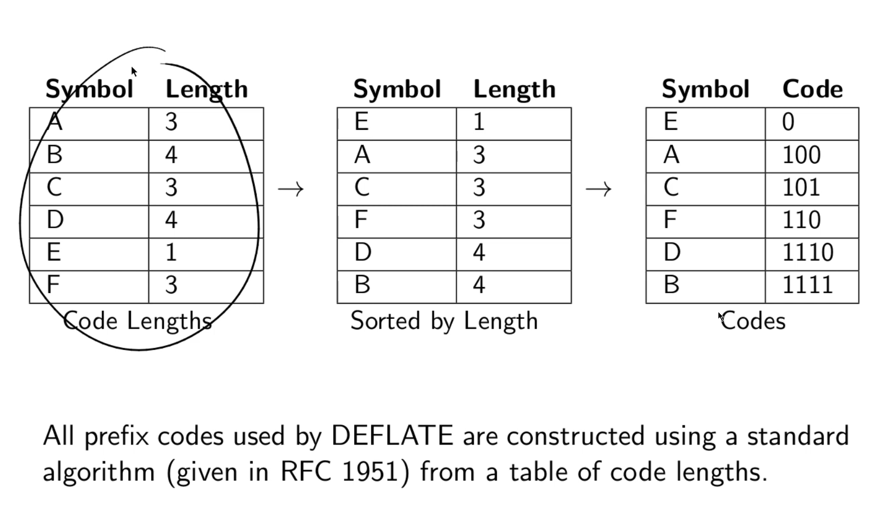

#### Block Type 1
 
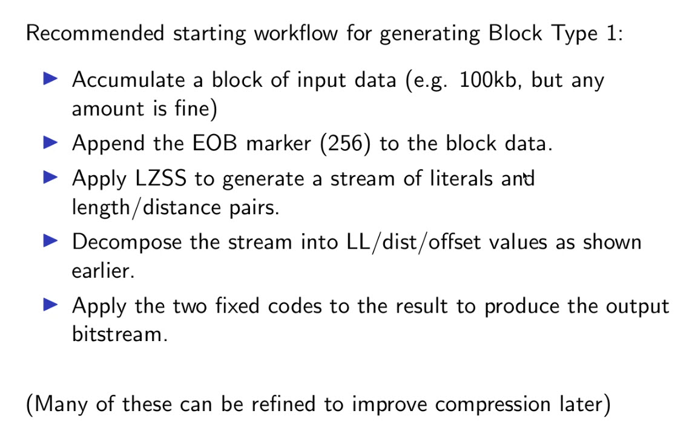

#### Block Type 2
 
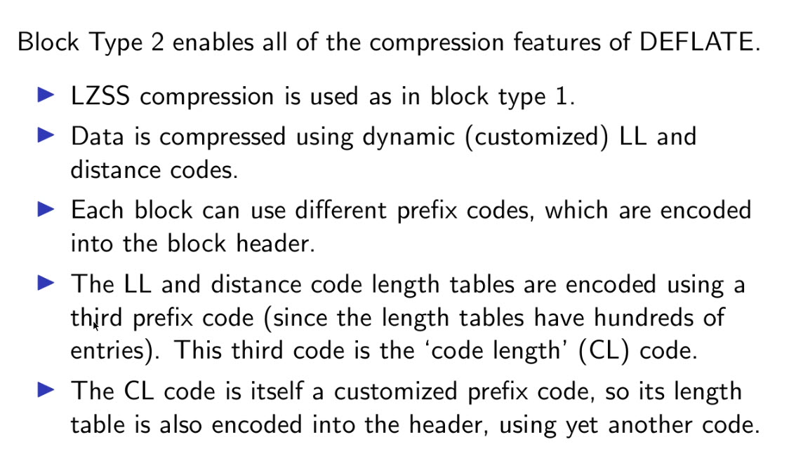

- Block type 2 is *nightmare* we need store those code tables

**LL** - Code Length Code
**CL** - Code Length Code Length code

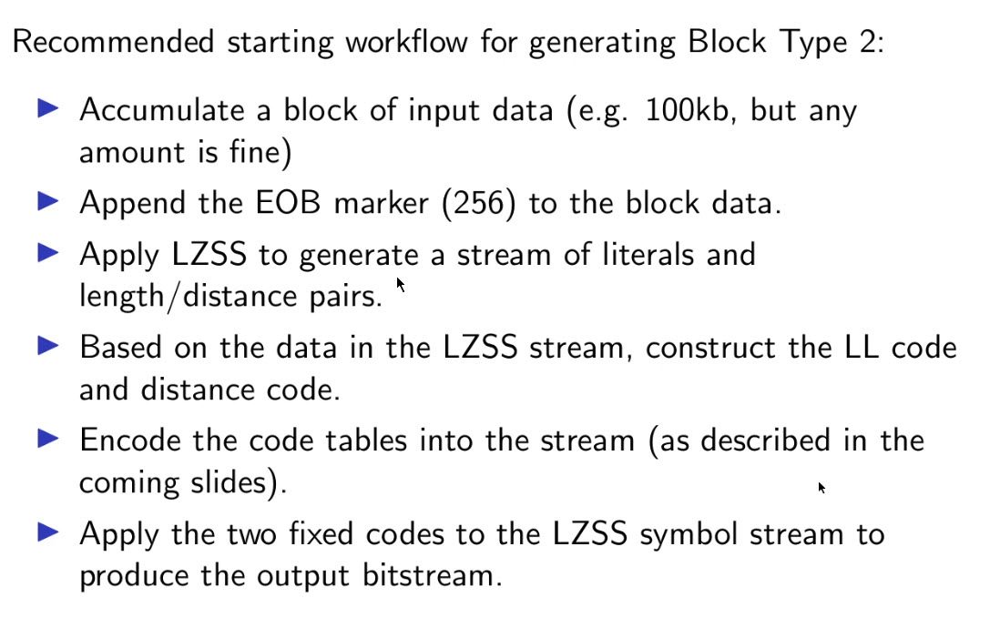

#### HCLEN

## Huffman coding

- Pakcage generelazation

BADBAC = `101100101101`


- Huffman tree nodes.

### RLE


**RLE** **R**un- **L**enght **E**ncoding

`12W1B12W3B24W1B14W`-> `WWWWWWWWWWWWBWWWWWWWWWWWWBBBWWWWWWWWWWWWWWWWWWWWWWWWBWWWWWWWWWWWWWW`
