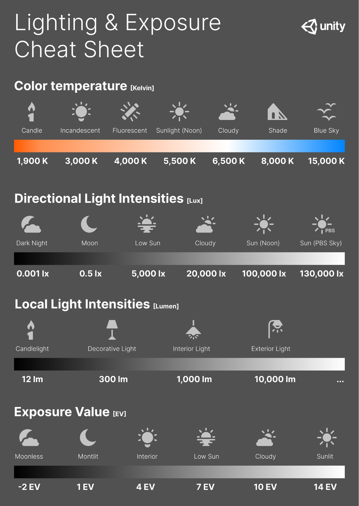
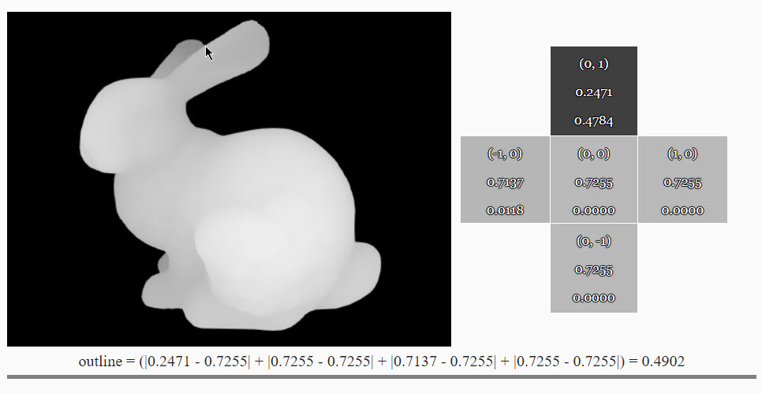
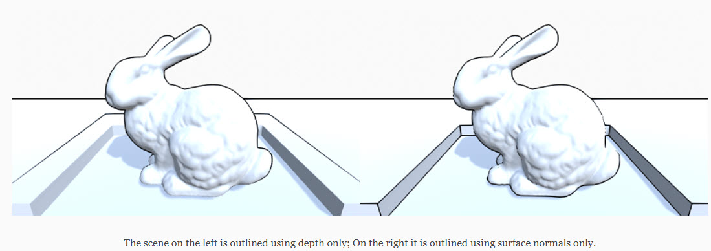
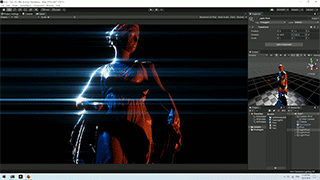
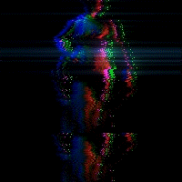

# Rendering

## Questions

- SRP ?
- HDR vs LDR ?
- Linear vs Gamma ?
- PBR Materials ?:
- Occulision Culling ?
- Optimization ?
- Post Processing stack v2 ?


- Study Materials
- Shader ?
- Culling ?
- Batching ?
- g-buffer ?
- Optimization ?
- Demo Project ?

## Roadmap

- [ ] Scriptbable Render Pipelin

## Practice

- [Scriptable Renderer pipeline](https://blog.unity.com/technology/srp-overview)
- Shader Graph projects

## Resources

- [Doom Frame Rendering](http://www.adriancourreges.com/blog/2016/09/09/doom-2016-graphics-study/)
- [Official Documentation Unity Graphics Manuals](https://docs.unity3d.com/Manual/Graphics.html)
- [Official Tutorials](https://learn.unity.com/search?k=[%22q%3AGraphics%22])
- [Official Graphic Optimization](https://learn.unity.com/tutorial/optimizing-graphics-in-unity#)
- [Into URP](https://learn.unity.com/tutorial/june-15-intro-to-urp#)
- [Packages Documentation]()
- [Occulision Culling Official](https://docs.unity3d.com/Manual/OcclusionCulling.html)

### Pakcages

- [Post Processing v2](https://docs.unity3d.com/Packages/com.unity.postprocessing@2.3/manual/index.html)
- [URP](https://docs.unity3d.com/Packages/com.unity.render-pipelines.universal@15.0/manual/integration-with-post-processing.html)

### Blog

- [ Rendering in Adam](https://blog.unity.com/games/rendering-and-shading-in-adam-episode-3)
- [Book move to URP](https://blog.unity.com/technology/move-on-over-to-the-universal-render-pipeline-with-our-advanced-guide)
- [2018 and Graphics](https://blog.unity.com/technology/2018-and-graphics)
- [Simulating LiDAR](https://blog.unity.com/manufacturing/velodyne-lidar-and-unity-team-up-to-enhance-lidar-simulation)


- [Book About Shaders]()
- [Nvidia about shaders]()
- [GitHubProject]()
- [JapaniesGuyGithub]()
- [Unity Blog]()

## Lightining

### CheetSheet




## Render Pipeline

#### Termps
- **SRP** - **S**criptable **R**enderer **P**ipeline
- **PBS** **P**hysics **B**ased **S**hader
- **Culling** - is a process of figuring out what will be in the scene
    - **Occulision culling** - prevent rendering calculation from hidden objects
    - **Frustum culling** - Calculating the objects that exist between the camera near plane and far plane.


### SRP

#### Links

- [SRP official Manuals](https://docs.unity3d.com/Manual/ScriptableRenderPipeline.html)

- [SRP Overview Blog](https://blog.unity.com/technology/srp-overview)
- [Demo Project from Article](https://github.com/stramit/SRPBlog/tree/master/SRP-Demo)

- [SRP Batch for WebGL](https://blog.unity.com/technology/srp-batcher-speed-up-your-rendering)
- [SRP Batch for WebGL SlideShow](https://www.khronos.org/assets/uploads/developers/presentations/Brendan-Duncan---Unity-SRP-Batcher-For-WebGL.pdf)

#### Questions

- SRP batching

Everything connected to the rendering.

High Level:

- Culling
- Rendering Objects
- Post-processing

Diffrent ways of rendering object:

- Multi-pass rendering
    - One pass object per light

- Single-pass rendering
    - onbe per ojbect

- Deferred 
    - Render surface properites to a g-buffer screen space lightning

### Usages

Basically SRP is used one of 4 ways: 

- Default Unity Render Pipeline
- URP 
- HDRP
- Custom Render Pipeline

Mainly when you need to work with Graphics optimize or gat better results


### Drawing

- HDR vs LDR
- Linear vs Gamma
- PBR Materials vs Simple Materilas
- Lightning vs No Lightning
- Lightning Technique 
- Shadow Technique


SRP is part of rendering pipeline


### Code

[Source](https://github.com/stramit/SRPBlog/tree/master/SRP-Demo/Assets/SRP-Demo)

#### Keys
```csarp
 class RenderPipeline 
 class RenderPipelineAsset 
 class ScriptableRenderContext
 class DrawRenderSettings
```


It's very basic example

`BasicPipelineInstance.cs`

```csharp
    public class BasicPipeInstance :RenderPipeline 
    {

        private readonly Color _clearColor ;


        public BasicPipeInstance()
        {
            _clearColor = Color.black;
        }

        public BasicPipeInstance(Color clearColor)
        {
            _clearColor = clearColor;
        }


        protected override void Render(ScriptableRenderContext context, Camera[] cameras)
        {
            var cmd = new CommandBuffer(); 
            cmd.ClearRenderTarget(true, true, _clearColor);
            context.ExecuteCommandBuffer(cmd);
            cmd.Release();
            context.Submit();
        }
    }
```

`BasicPipeAsset.cs`

```csharp

        [ExecuteInEditMode]
        public class BasicAssetPipe:RenderPipelineAsset 
        {
            [SerializeField]
            private Color _clearColor = Color.green;
    #if UNITY_EDITOR
            [UnityEditor.MenuItem("SRPDemo/CreateBasic")]
            static void CreateBasicAssetPipeline()
            {
                var instance = ScriptableObject.CreateInstance<BasicAssetPipe>();
                UnityEditor.AssetDatabase.CreateAsset(instance,"Assets/BleedingPipe.asset");


            }
    #endif

        protected override RenderPipeline CreatePipeline()
        {
            return new BasicPipeInstance(_clearColor);
        }
    }
```
`TransperentAssetPipe.cs`

```csharp
 public override void Render(ScriptableRenderContext context, Camera[] cameras)
    {
        base.Render(context, cameras);

        foreach (var camera in cameras)
        {
            // Culling
            ScriptableCullingParameters cullingParams;
            if (!CullResults.GetCullingParameters(camera, out cullingParams))
                continue;

            CullResults cull = CullResults.Cull(ref cullingParams, context);

            // Setup camera for rendering (sets render target, view/projection matrices and other
            // per-camera built-in shader variables).
            context.SetupCameraProperties(camera);

            // clear depth buffer
            var cmd = new CommandBuffer();
            cmd.ClearRenderTarget(true, false, Color.black);
            context.ExecuteCommandBuffer(cmd);
            cmd.Release();

            // Draw opaque objects using BasicPass shader pass
            var settings = new DrawRendererSettings(camera, new ShaderPassName("BasicPass"));
            settings.sorting.flags = SortFlags.CommonOpaque;

            var filterSettings = new FilterRenderersSettings(true) { renderQueueRange = RenderQueueRange.opaque };
            context.DrawRenderers(cull.visibleRenderers, ref settings, filterSettings);

            // Draw skybox
            context.DrawSkybox(camera);

            // Draw transparent objects using BasicPass shader pass
            settings.sorting.flags = SortFlags.CommonTransparent;
            filterSettings.renderQueueRange = RenderQueueRange.transparent;
            context.DrawRenderers(cull.visibleRenderers, ref settings, filterSettings);

            context.Submit();
        }
```
##### Culling


```csharp
// Create an structure to hold the culling paramaters
ScriptableCullingParameters cullingParams;

//Populate the culling paramaters from the camera
if (!CullResults.GetCullingParameters(camera, stereoEnabled, out cullingParams))
    continue;

// if you like you can modify the culling paramaters here
cullingParams.isOrthographic = true;

// Create a structure to hold the cull results
CullResults cullResults = new CullResults();

// Perform the culling operation
CullResults.Cull(ref cullingParams, context, ref cullResults);;
```
##### Buckets and Layers

```csharp
// Get the opaque rendering filter settings
var opaqueRange = new FilterRenderersSettings();

//Set the range to be the opaque queues
opaqueRange.renderQueueRange = new RenderQueueRange()
{
    min = 0,
    max = (int)UnityEngine.Rendering.RenderQueue.GeometryLast,
};

//Include all layers
opaqueRange.layerMask = ~0;

```
##### Draw settings

`DrawRenderSettings`

- **Sorting** - Order of rendering
- PerRenderFlags - `built in` settings perobject light,objct light maps, e.t.c
- **Rendering flags** -  Which algorithm should be used for batching

- Shader Pass - Which shader pass should be used for the current draw call 

```csharp
// Create the draw render settings
// note that it takes a shader pass name
var drs = new DrawRendererSettings(Camera.current, new ShaderPassName("Opaque"));

// enable instancing for the draw call
drs.flags = DrawRendererFlags.EnableInstancing;

// pass light probe and lightmap data to each renderer
drs.rendererConfiguration = RendererConfiguration.PerObjectLightProbe | RendererConfiguration.PerObjectLightmaps;

// sort the objects like normal opaque objects
drs.sorting.flags = SortFlags.CommonOpaque;
```

##### Drawing

We unite:

- Cull results
- Filtring fules 
- Drawing rules

```csharp

// draw all of the renderers
context.DrawRenderers(cullResults.visibleRenderers, ref drs, opaqueRange);


// submit the context, this will execute all of the queued up commands.
context.Submit();

```
 
## URP

#### Links

- [BoatAttack](https://github.com/Unity-Technologies/BoatAttack)
- [URP Examples](https://github.com/Unity-Technologies/UniversalRenderingExamples)


## HRDRP


## Stereo Rendering

[Stereo Rendering](https://docs.unity3d.com/Manual/SinglePassStereoRendering.html)

## Post-processing

### Links

- [Official Documentation](https://docs.unity3d.com/Packages/com.unity.postprocessing@3.1/index.html)
- [Unity post-processing stack](https://github.com/Unity-Technologies/PostProcessing/wiki)
- [Kino custom post-processing](https://github.com/keijiro/Kino)

## Shader

### Questions

- Vertex Shader vs Pixel Shader ?
- UV ?
- Queue ?
- ZWrite ON ?
- Color Mask 0 ?
- GBuffer ?


### Links
- [Writing Shader](https://docs.unity3d.com/Manual/shader-writing.html)

### Questions

- Opague vs Transperent
- URP Lit vs Default vs PBR


### Outline Shader

##### Terms

**Sobel Operator** - is a classid edge detection convolution filter

##### Links

- [Pixal Paper on Toon Shader](https://graphics.pixar.com/library/ToonRendering/paper.pdf)

- [Unity custom post-processing Angle Silhouette](https://www.vertexfragment.com/ramblings/unity-deferred-post-processing/)

- [Sobel Outline](https://www.vertexfragment.com/ramblings/unity-postprocessing-sobel-outline/)


- [Outline Shader](https://roystan.net/articles/outline-shader.html)


#### Vertex Fragmen Outline Post-Processing

- [Article link](https://www.vertexfragment.com/ramblings/unity-postprocessing-sobel-outline/)

##### Questions

- What is changing when I change rendering path ?
- What is `cull` in cg
- Is there any information about color of outline
- Conection between Shader and Post Processing 
- How to get one of the Buffers
- What are those buffers ? 
- What is Surfece normals ?
- What is Depth only in post processing?
- What is HLSL shader ?





`PostProcessEffectRenderer`

## Post-Processing

### Questions

- What are the stages of PostProcessing ?
- What buffers do we have access to ? 
- What type of Shader do we use for Post Processing ?

### Links

- [Post Processing Stack v2](https://docs.unity3d.com/Packages/com.unity.postprocessing@3.2/manual/index.html)
- [Surface Angle Sihouuette with Unity Post-Processing](https://www.vertexfragment.com/ramblings/unity-deferred-post-processing/)

#### Insparation

##### Keijiro Kino project

- [Github link](https://github.com/keijiro/Kino)




##### Doom Frame Rendering

- [Article link](http://www.adriancourreges.com/blog/2016/09/09/doom-2016-graphics-study/)
r


    
### Surface Angle Silhoutte 

- [Link](https://www.vertexfragment.com/ramblings/unity-deferred-post-processing/)


#### Questions

- What a fuck is GBuffer ?
- How to access GBuffer ? 
- Extra GBuffer layer ?	


#### Reconstruction the Scene


#### Stereo Render


- [Unity guide into Single Pass Stereo Rendering](https://docs.unity3d.com/Manual/SinglePassStereoRendering.html)

##### Questions

- A0 Pixel shader vs Vertex Shader ?
- A1 Diffrence in rendering between normal and Transperent?
- Buffers for maps in Unity ?
- What diffrences between nomral and Stereo Rendere ?
- Vertex vs Fragment shader.
- ZWrite ONhttps://github.com/Unity-Technologies/UniversalRenderingExamples vs ZWrite OFF


### Unieversal Rendering Pipeline


- [Gihub URP Examples](https://github.com/Unity-Technologies/UniversalRenderingExamples)

#### Links

-  [Main page](https://unity.com/srp/universal-render-pipeline#extendable-and-customizable)


##### Questions

- What id diffrence betwenn default shader and lit by URP
