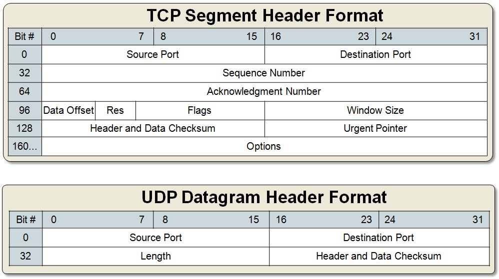
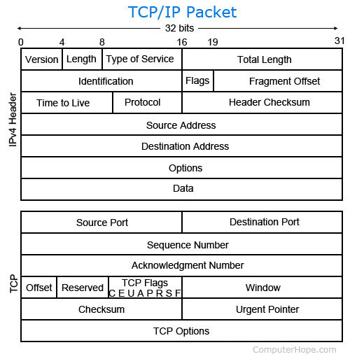

# TCP Syntaxis 

##### Header
* **IP**    (**I**nternet **P**rotocol)
* **TCP**   (**T**ransaction **C**ontrol **P**rotocol)
* **UDP**   (**U**ser **D**atagram **P**rotocol) 

##### Content
* **HTTP**  (**H**yper **T**ext **T**ransaction **P**rotocol)
* **HTTPS** (**H**yper **T**ext **T**ransaction **P**rotocol **S**ecure)
* **FTP**   (**F**ile **T**ransaction **P**rotocol)
* **SMTP**  (**S**imple **M**ail **T**ransaction **P**rotocol)

##### Extra
* **AES**   (**A**dvenced **E**ncryption **S**tandart)
* **REST**  (**Re**presentive **S**tate **T**ransfer)
* **API**   (**A**plication **P**rograming **I**nterface)

**NET**
***ASP**   (**A**ctive **S**erver **P**age)
* **IIS**   (**I**nternet **I**nvormation **S**ervice)
* **SOAP**  (**S**imple **O**bject **A**ccess **P**rotocol)

* **SSH**   (**S**ecure **Sh**ell)
* **SaaS**  (**S**oftware **a**s **a** **S**ervice) -  allows users to connect to and use cloud-based apps over the Internet. 
* **RPC**   (**R**emote **P**rodurall **C**all)

## TCP vs UDP

**UDP** - Content Discription.  
> 8 bits

**TCP** - UDP + Controls Pockets delivery.
>20 bits

